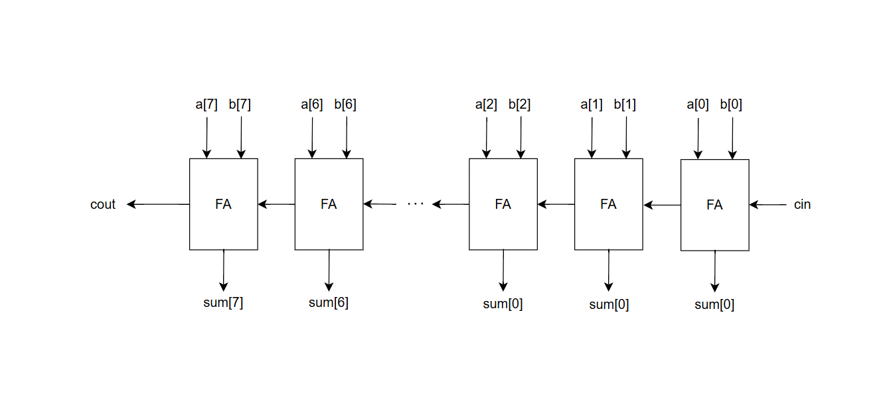
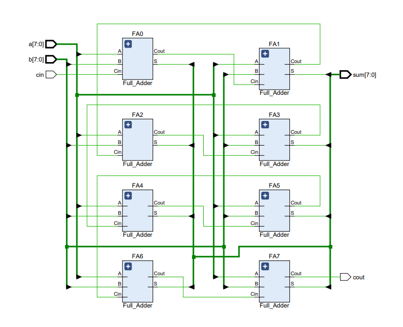
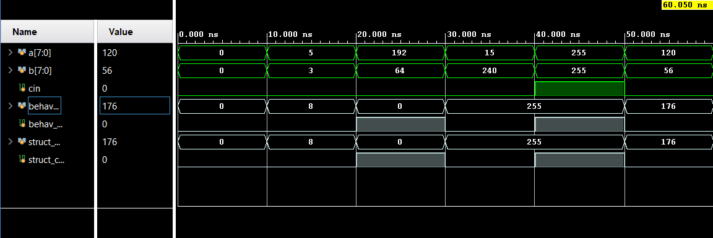

# 8-bit Structural Ripple-Carry Adder

This project implements a structural 8-bit Ripple-Carry Adder (RCA) in Verilog. It was developed as part of the **Google & Reichman Tech School Chip Design & Verification** course.

The design is built from the ground up, starting with a 1-bit `Full_Adder` module, which is then instantiated 8 times to create the final 8-bit `Top_RCA` module.

---

## 🖥️ RCA Design Architecture

The design is a classic Ripple-Carry Adder. It is built from 8 instances of a 1-bit `Full_Adder` module. The carry-out (`Cout`) from each bit (starting at bit 0) is "rippled" to the carry-in (`Cin`) of the next bit, creating the carry chain.

### Micro-Architecture Diagram

This is the top-level block diagram for the 8-bit `Top_RCA` module, showing the 8 `Full_Adder` blocks chained together.


[cite_start]*(Image from `ChipDesign_Lab2.docx` [cite: 30-31])*


## 🛠️ Implementation Results (Vivado)

The RTL schematic from the Vivado Elaborated Design view confirms the structural implementation. It clearly shows the 8 `Full_Adder` (FA) modules instantiated and connected in series, exactly as designed in the block diagram.

### Vivado RTL Schematic (Lint Design)


*(Image from `ChipDesign_Lab2.docx` [cite: 53-54])*

## 📊 Verification & Simulation Results

The design was verified using a shared testbench (`tb_Top_RCA.sv`) that ran 5 directed test cases to check for various conditions (no carry, with carry, max value, max overflow).

## 📊 Verification & Simulation Results

The design was verified using a shared testbench (`tb_Top_RCA.sv`) that ran 5 directed test cases to check for various conditions (no carry, with carry, max value, max overflow).

### Simulation Waveform

This waveform snapshot shows the inputs (`a`, `b`, `cin`) changing over time and the corresponding correct output (`struct_sum`, `struct_cout`) for the structural adder.


*(**Note:** You must upload your waveform screenshot to `images/simulation_waveform.png`)*

### Simulation Console Output

The simulation output from the TCL console is shown below. All 5 assertions passed, confirming the structural adder (`struc_sum`, `struc_cout`) produced the correct results for all test cases.

*(Note: The log was edited to only show the structural adder's results for clarity)*

```tcl
Time resolution is 1 ps
Time:      0 | a:   0 | b:   0 | struc sum:   0 | struc cout: 0
Time:  10000 | a:   5 | b:   3 | struc sum:   8 | struc cout: 0
ASSERT 1 : No Carry-out SUCCEED!
Time:  20000 | a: 192 | b:  64 | struc sum:   0 | struc cout: 1
ASSERT 2 : No Carry-out SUCCEED!
Time:  30000 | a:  15 | b: 240 | struc sum: 255 | struc cout: 0
ASSERT 3 : no carry_out, max value SUCCEED!
Time:  40000 | a: 255 | b: 255 | struc sum: 255 | struc cout: 1
ASSERT 4 : max overflow SUCCEED!
Time:  50000 | a: 120 | b:  56 | struc sum: 176 | struc cout: 0
ASSERT 5 : no carry-out SUCCEED!
SIMULATION COMPLETED SUCCESSFULLY!


